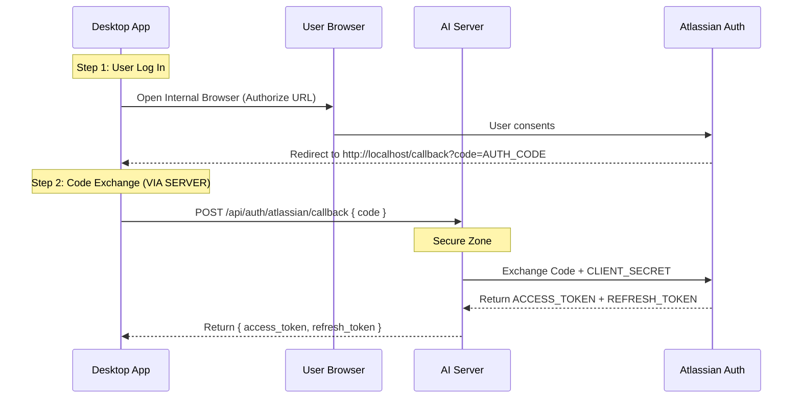
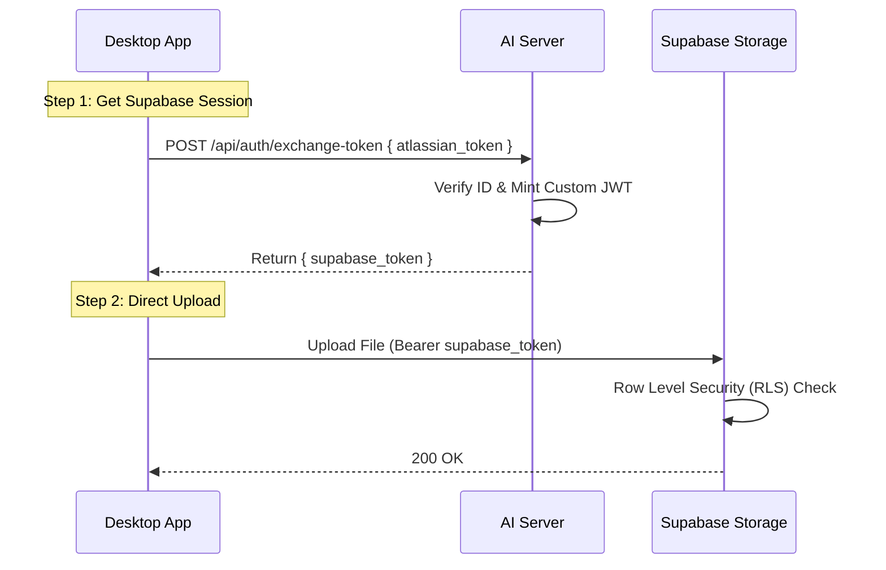

# Feature Specification: Secure Token Exchange Architecture

**Version:** 1.1 `(Updated: Added Atlassian Secret Remediation)`
**Status:** PROPOSED
**Author:** Antigravity AI

---

## 1. Executive Summary
This document outlines the architectural changes required to remediate **Critical Security Vulnerabilities** in the `python-desktop-app`.

**Objective:**
1.  Remove the **Supabase Service Role Key** (access to full DB).
2.  Remove the **Atlassian Client Secret** (access to impersonate the app).

**Target Architecture:**
All "Secrets" will be moved to the **AI Server**. The Desktop App will become a "Public Client" that relies on the AI Server for all privileged operations.

---

## 2. Problem Statement
**Current State:**
The `python-desktop-app` binary contains two critical secrets:
1.  `SUPABASE_SERVICE_ROLE_KEY`: Allows full administrative access to the database.
2.  `ATLASSIAN_CLIENT_SECRET`: Allows the app to exchange OAuth codes for user tokens.

**Risk Analysis:**
*   **Severity:** Critical (CVSS 10.0)
*   **Attack Vector:** Binary Decompilation.
*   **Impact:**
    *   **Supabase Key:** Full database deletion, global data theft.
    *   **Atlassian Secret:** Attackers can impersonate your app to phish users or spam Atlassian APIs, leading to your app being banned.

---

## 3. Detailed Workflows

### 3.1 Workflow A: Atlassian OAuth (The Login)
*Goal: Remove `ATLASSIAN_CLIENT_SECRET` from Desktop.*

**Result:** The Desktop App only handles the temporary `access_token`. It never sees the `CLIENT_SECRET`.

### 3.2 Workflow B: Supabase Access (The Upload)
*Goal: Remove `SUPABASE_SERVICE_ROLE_KEY` from Desktop.*

---

## 4. Technical Specifications

### 4.1 AI Server Endpoints
**1. OAuth Callback Proxy:** `POST /api/auth/atlassian/callback`
*   **Input:** `{ code: "..." }`
*   **Action:** Calls Atlassian `https://auth.atlassian.com/oauth/token` using the hidden `CLIENT_SECRET`.
*   **Output:** Returns the user tokens.

**2. Token Exchange:** `POST /api/auth/exchange-token`
*   **Input:** `{ atlassian_token: "..." }`
*   **Action:** Mints a 1-hour Supabase JWT for the user.
*   **Output:** `{ supabase_token: "..." }`

### 4.2 Desktop App Changes
1.  **Configuration:** DELETE `SUPABASE_SERVICE_ROLE_KEY` and `ATLASSIAN_CLIENT_SECRET`.
2.  **Login Logic:** Instead of calling Atlassian directly to swap the code, call `ai-server`.
3.  **Upload Logic:** Instead of using the Service Key, request a token from `ai-server` and use it.

---

## 5. Security Benefits
| Feature | Old Architecture | New Architecture |
| :--- | :--- | :--- |
| **Supabase Access** | **Admin Key** (Unrestricted) | **User Token** (Restricted by RLS) |
| **Atlassian OAuth** | **Secret embedded** in App | **Secret kept on Server** |
| **Maintenance** | Passwords hard to rotate | Rotate keys on Server instantly |
