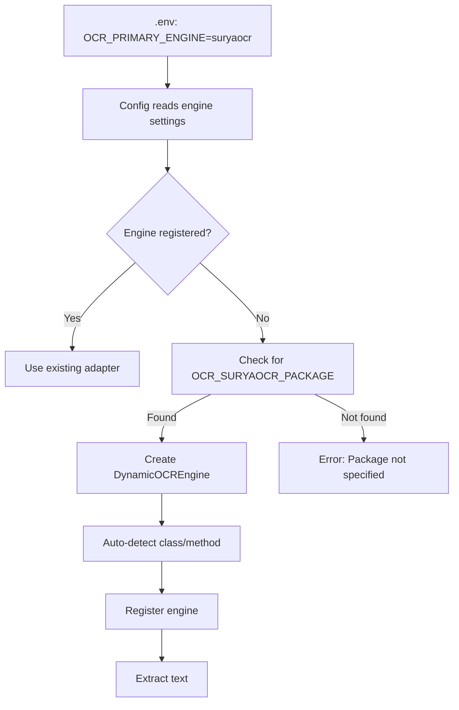

# Dynamic OCR Engine System

## Overview

The JIRAForge OCR system now supports **automatic engine creation** - you no longer need to write adapter code for every OCR library you want to use!

## How It Works



## Configuration

### Built-in Engines (Pre-configured)

These engines have dedicated adapters with optimizations:
- `paddle` - PaddleOCR (PP-OCRv5)
- `tesseract` - Tesseract OCR
- `easyocr` - EasyOCR
- `mock` - Mock engine (testing)
- `demo` - Demo engine (example)

### Dynamic Engines (Auto-created)

Any other engine name triggers dynamic creation:

```env
OCR_PRIMARY_ENGINE=<engine_name>
OCR_<ENGINE>_PACKAGE=<python_package>
OCR_<ENGINE>_MIN_CONFIDENCE=0.7
OCR_<ENGINE>_USE_GPU=true
OCR_<ENGINE>_LANGUAGE=en

# Optional advanced settings:
OCR_<ENGINE>_CLASS=ClassName        # Specific class to use
OCR_<ENGINE>_METHOD=method_name     # Specific method to call
```

## Examples

### SuryaOCR

```env
OCR_PRIMARY_ENGINE=suryaocr
OCR_SURYAOCR_PACKAGE=surya
OCR_SURYAOCR_MIN_CONFIDENCE=0.7
OCR_SURYAOCR_USE_GPU=true
```

```bash
pip install surya-ocr
python -m tests.test_ocr_engines --engine suryaocr
```

### TrOCR (Hugging Face)

```env
OCR_PRIMARY_ENGINE=trocr
OCR_TROCR_PACKAGE=transformers
OCR_TROCR_MIN_CONFIDENCE=0.8
OCR_TROCR_MODEL=microsoft/trocr-base-printed
```

```bash
pip install transformers torch pillow
python -m tests.test_ocr_engines --engine trocr
```

### DocTR

```env
OCR_PRIMARY_ENGINE=doctr
OCR_DOCTR_PACKAGE=python-doctr
OCR_DOCTR_MIN_CONFIDENCE=0.75
OCR_DOCTR_USE_GPU=true
```

```bash
pip install python-doctr[torch]
python -m tests.test_ocr_engines --engine doctr
```

### Keras OCR

```env
OCR_PRIMARY_ENGINE=kerasocr
OCR_KERASOCR_PACKAGE=keras_ocr
OCR_KERASOCR_MIN_CONFIDENCE=0.7
```

```bash
pip install keras-ocr
python -m tests.test_ocr_engines --engine kerasocr
```

## Auto-Detection

The `DynamicOCREngine` automatically detects:

### Common Class Names
- `<EngineName>OCR`
- `OCR`
- `Reader`
- `Recognizer`
- `Detector`

### Common Method Names
- `extract_text()`
- `recognize()`
- `ocr()`
- `detect_and_recognize()`
- `read()`
- `readtext()`
- `process()`

### Common Parameter Names
- GPU: `use_gpu`, `gpu`, `device`
- Language: `lang`, `language`, `languages`
- Confidence: `confidence`, `conf`, `min_confidence`

## Result Parsing

The system automatically parses various result formats:

### Plain String
```python
result = "extracted text"
# Parsed to: {'text': 'extracted text', 'confidence': 0.95}
```

### Dictionary
```python
result = {'text': 'extracted text', 'confidence': 0.92}
# Already standardized
```

### List of Tuples
```python
result = [('text1', 0.9), ('text2', 0.85)]
# Parsed to: {'text': 'text1\ntext2', 'confidence': 0.875}
```

### List with Bounding Boxes
```python
result = [
    ([[x, y], [x, y], ...], 'text1', 0.9),
    ([[x, y], [x, y], ...], 'text2', 0.85)
]
# Parsed with boxes preserved
```

## Add Dependencies to Auto-Installer

To enable automatic installation, add to `ocr/auto_installer.py`:

```python
ENGINE_DEPENDENCIES = {
    'suryaocr': [
        'surya-ocr>=0.4.0',
        'torch>=2.0.0',
        'transformers>=4.35.0',
    ],
    # ... other engines
}
```

## Testing

Test any engine:

```bash
# Test specific engine
python -m tests.test_ocr_engines --engine suryaocr

# Test with screenshot
python -m tests.test_ocr_engines --engine suryaocr --screenshot

# Test with custom image
python -m tests.test_ocr_engines --engine suryaocr --image test.png

# Skip dependency auto-install
python -m tests.test_ocr_engines --engine suryaocr --skip-deps
```

## Advanced Configuration

### Override Class Name

If auto-detection fails, specify the class:

```env
OCR_MYENGINE_PACKAGE=myocr
OCR_MYENGINE_CLASS=MyOCRReader
```

### Override Method Name

If the library uses a non-standard method:

```env
OCR_MYENGINE_PACKAGE=myocr
OCR_MYENGINE_METHOD=perform_recognition
```

### Custom Initialization Parameters

Any unknown parameters become initialization arguments:

```env
OCR_MYENGINE_PACKAGE=myocr
OCR_MYENGINE_MODEL_PATH=/path/to/model
OCR_MYENGINE_BATCH_SIZE=4
OCR_MYENGINE_TIMEOUT=30
```

These are passed to the OCR class constructor:
```python
MyOCRClass(
    use_gpu=False,
    language='en',
    model_path='/path/to/model',
    batch_size=4,
    timeout=30
)
```

## Limitations

1. **Library Interface**: Works best with libraries that have consistent interfaces
2. **Result Format**: Library must return text or structured results
3. **Complex Pipelines**: Multi-step pipelines may need custom adapters
4. **Async Operations**: Synchronous calls only (no async support)

## When to Create Custom Adapters

Create dedicated engine files for:
- ✅ Complex initialization (multi-model setup)
- ✅ Performance-critical engines (avoid detection overhead)
- ✅ Special result parsing requirements
- ✅ Version-specific handling (like PaddleOCR 2.x vs 3.x)
- ✅ Production engines used frequently

Use dynamic engines for:
- ✅ Quick testing of new libraries
- ✅ One-off experiments
- ✅ Simple OCR libraries with standard interfaces
- ✅ Prototyping before creating custom adapter

## Migration from Custom to Dynamic

If you have a custom engine file but want to use dynamic creation:

1. Keep the file for reference
2. Configure in `.env`:
   ```env
   OCR_MYENGINE_PACKAGE=myocr_lib
   ```
3. Test with dynamic engine
4. Delete custom file if dynamic works well

## Troubleshooting

### Engine Not Found

```
ValueError: Unknown OCR engine: 'suryaocr'
```

**Solution**: Set `OCR_SURYAOCR_PACKAGE` in `.env`

```env
OCR_SURYAOCR_PACKAGE=surya
```

### Package Not Installed

```
suryaocr not available. Install: pip install surya
```

**Solution**: Install the package:
```bash
pip install surya-ocr
```

### Auto-detection Failed

```
Could not find OCR method for myengine
```

**Solution**: Manually specify class/method:
```env
OCR_MYENGINE_CLASS=OCRProcessor
OCR_MYENGINE_METHOD=recognize_text
```

### Unknown Result Format

```
Unknown result format: <class 'MyCustomResult'>
```

**Solution**: Create a custom adapter to handle the specific result format.

## Contributing

When adding official support for a popular engine:

1. Create dedicated adapter in `ocr/engines/<engine>_engine.py`
2. Add to `ENGINE_DEPENDENCIES` in `auto_installer.py`
3. Add to `package_map` in `engine_factory.py`
4. Document in main README

This provides:
- Better performance (no auto-detection)
- Better error handling
- Version-specific optimizations
- Production-ready reliability
